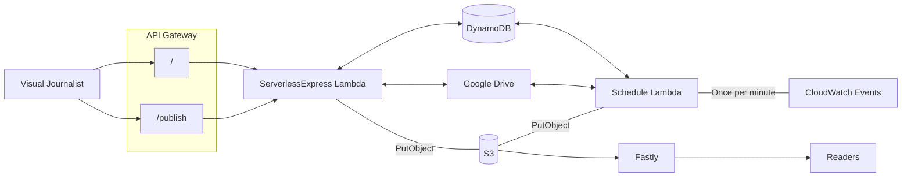

# GUDocs 2

Google Docs to S3 uploader

* Google Docs -> ArchieML -> S3
* Google Sheets -> CSV -> JSON -> S3

## Moving parts

The application effectively has three functions:
- **List** documents that have been shared with the service, including their modified and published status
- **Publish** a document from Google Drive to S3
- **Scheduled task** that runs once a minute to automatically publish any modified documents to a test folder in S3

The list and publish functions are accessible via a http interface, behind Panda/Google auth. The scheduled lambda is triggered by CloudWatch.

## Architecture Diagram

