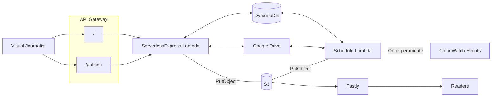

# GUDocs 2

Google Docs to S3 uploader

* Google Docs -> ArchieML -> S3
* Google Sheets -> CSV -> JSON -> S3

Description of how users users interact with the service

## Moving parts

The application effectively has three functions:
- **List** documents that have been shared with the service, including their modified and published status
- **Publish** a document from Google Drive to S3
- **Scheduled task** that runs once a minute to automatically publish any modified documents to a test folder in S3

The list and publish functions are accessible via a http interface, behind Panda/Google auth. The scheduled lambda is triggered by CloudWatch.

## Architecture Diagram

## Running locally

There is no separate DynamoDb table or S3 bucket for local development, so when you run this locally you will be using the CODE resources. This does mean that you may need to pause the CODE schedule lambda if you want to test the schedule function without interference from CODE.

* Fetch [Janus](https://janus.gutools.co.uk/credentials?permissionId=interactives-dev&tzOffset=1) credentials for Interactives account
* Run `scripts/setup` to configure nginx and install yarn dependencies
* Run `yarn start` to start the application
* The UI should now be available at https://gudocs.local.dev-gutools.co.uk

To test the schedule function, there is a convenience HTTP endpoint `/schedule` which is only available locally:

`curl -X POST http://localhost:3037/schedule`