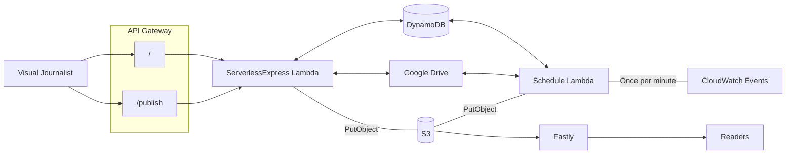

# GUDocs 2

The gudocs tool allows visuals and interactive journalist to easily create JSON datasources for interactives from Google Docs and Sheets.

For example, the [Men's football transfer window](https://www.theguardian.com/football/ng-interactive/2023/feb/01/mens-transfer-window-january-2023-premier-league-bundesliga-ligue-1-la-liga-serie-a) article is powered from [a JSON file](https://interactive.guim.co.uk/2023/tw-men-winter-2023/transfersData.json). This JSON file is generated from a spreadsheet by the gudocs tool.

Journalists interact with the tool through the web interface at https://gudocs.gutools.co.uk. From this interface they can publish a document from Google Docs to S3. All documents that are shared with the relevant google service account are published automatically to the `docsdata-test` folder when they are modified.

Google Docs are processed using [ArchieML](https://archieml.org/) before being written to S3. Google Sheets are written out as JSON using the column headings as the keys.

## Moving parts

The application has three functions:
- **List** documents that have been shared with the service, including their modified and published status
- **Publish** a document from Google Drive to S3
- **Scheduled task** that runs once a minute to automatically publish any modified documents to a test folder in S3

The list and publish functions are accessible via a http interface, behind Panda/Google auth. The scheduled lambda is triggered by CloudWatch.

## Architecture Diagram

## Running locally

There is no separate DynamoDb table or S3 bucket for local development, so when you run this locally you will be using the CODE resources. This does mean that you may need to pause the CODE schedule lambda if you want to test the schedule function without interference from CODE.

* Fetch [Janus](https://janus.gutools.co.uk/credentials?permissionId=interactives-dev&tzOffset=1) credentials for Interactives account
* Run `scripts/setup` to configure nginx and install yarn dependencies
* Run `yarn start` to start the application
* The UI should now be available at https://gudocs.local.dev-gutools.co.uk

To test the schedule function, there is a convenience HTTP endpoint `/schedule` which is only available locally:

`curl -X POST http://localhost:3037/schedule`

## Deploying

The application is two lambdas deployed [using Riff-Raff](https://riffraff.gutools.co.uk/deployment/history?projectName=interactives%3A%3Agudocs2).

## Basic functionality test

Navigate to https://gudocs.code.dev-gutools.co.uk
- Can you see a list of recently modified files?
- Does the "last updated" message show a time under 2 minutes ago?

Share a doc with the docs tool email address
- Does it appear on the list within a couple of mintues?
- Does the "test" link for your document load some JSON?

Click on the publish button for the doc you have shared
- Does the "docs" link for you document load some JSON?
